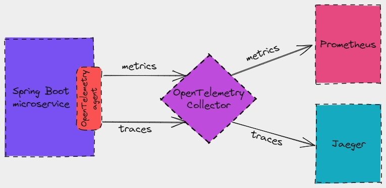
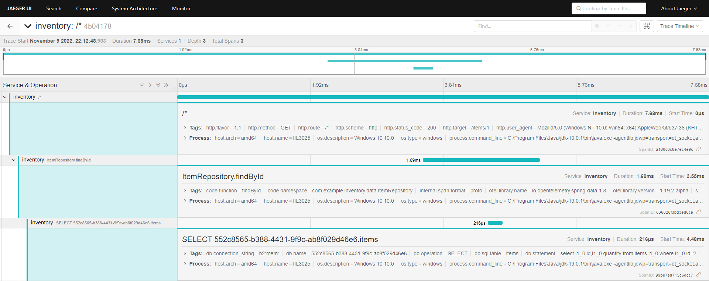

## Intro

Microservices architecture is becoming the de facto standard for web applications.
But with the different benefits of Microservices also comes increased system complexity, making effective debugging and anomaly detection harder as complexity increases.
Requests moving back and forth between different services, events being raised, messages being exchanged continuously etc can make hunting for bugs, performance issues and general failures increasingly difficult.

To compensate for this, we need systems that are "observable", i.e. their internal state can be inferred by tracking and observing metrics, traces and logs.
Observability is all about data exposure and easy access to information required to find issues when communications fail, internal events do not occur as expected or events occur when they shouldn't.

In this post we'll see how to capture and export traces and metrics from a Spring Boot microservice using OpenTelemetry.
Then we will export this data to Jaeger and Prometheus and use Grafana for visualization.

## OpenTelemetry

OpenTelemetry (OTel for short) is a set of tools that instrument, generate, collect and export telemetry data (logs, traces and metrics).
OpenTelemetry can export telemetry data directly to different backends, like Jaeger, zipkin and prometheus.
But it can also export to a central collector that will receive the data, process it and then export to the different backends.

## Running the OpenTelemetry collector

In this tutorial, our microservice will push telemetry data to OpenTelemetry Collector which in turn will push traces to Jaeger and expose metrics for Prometheus to pull.



We'll run OpenTelemetry Collector, Jaeger, Prometheus and Grafana with docker, using the follow docker-compose file:

```yaml
version: "3"

services:

  otel-collector:
    image: otel/opentelemetry-collector
    container_name: otel-collector
    command: ["--config=/etc/config.yml"]
    volumes:
      - ./otel-collector/config.yml:/etc/config.yml
    ports:
      - "4317:4317" # OTLP gRPC receiver port
      - "8889:8889" # Promentheus exporter metrics
      
  prometheus:
    image: prom/prometheus:latest
    container_name: prometheus
    ports:
      - "9090:9090"
    volumes:
      - ./prometheus/config.yml:/etc/prometheus/prometheus.yml
  
  jaeger:
    image: jaegertracing/all-in-one:latest
    container_name: jaeger
    ports:
      - "6831:6831/udp"
      - "14250:14250"
      - "16686:16686"
      
  grafana:
    image: grafana/grafana:latest
    container_name: grafana
    ports:
      - "3000:3000"
```

For the collector container, we will expose port *4317*, which is when the collector is receiving telemetry data in OTLP format, via gRPC. 
By default, the OpenTelemetry agent is pushing telemetry data to *localhost:4317* using gRPC.
We are also exposing port *8889*; the collector will be exposing metrics data there, which Promentheus will pull.

### OpenTelemetry Collector configuration

This is the configuration for OpenTelemetry Collector. We need to define receivers, processors exporters, and then bind them in pipelines:

```yaml
receivers:
  otlp:
    protocols:
      grpc:

processors:

exporters:
  prometheus:
    endpoint: "0.0.0.0:8889"
  jaeger:
    endpoint: "jaeger:14250"
    tls:
      insecure: true

service:
  pipelines:
    traces:
      receivers: [otlp]
      processors: []
      exporters: [jaeger]
    metrics:
      receivers: [otlp]
      processors: []
      exporters: [prometheus]

```

First, we define a receiver to receive telemetry data in OTLP format. 
We won't use any processors for this tutorial.
Then we define a couple of exporterts. One to export data in Promentheus format and one in Jaeger format.
Finally, we define one pipeline for traces, which will receive otlp data and export it to Jaeger; and one for metrics that will also receive otlp data and export to Prometheus.

### Promentheus configuration

For the Promentheus configuration, we will define a simple scrape job that will pull metrics from the *:8889/metrics* endpoint that the collector is providing:

```yaml
global:
  scrape_interval:     15s
  evaluation_interval: 15s

scrape_configs:
  - job_name: 'example'
    metrics_path: '/metrics'
    scrape_interval: 5s
    static_configs:
      - targets: ['otel-collector:8889']
```

## Insturmenting the microservice

### Source code

Let's have a quick look at the microservice that we'll use throughout this post. The source code can be found [here](http://www.github.com). 
It's a simple service with a single REST endpoint, `GET items/{itemId}`, that returns data from a H2 in memory database.

### OpenTelemetry agent

To instrument our Java microservice, we just have to run it with the OpenTelemetry Java agent:

```bash
java -javaagent:../agent/opentelemetry-javaagent.jar -jar inventory-0.0.1-SNAPSHOT.jar
```

> The latest version of the agent can be found here [opentelemetry-java-instrumentation](https://github.com/open-telemetry/opentelemetry-java-instrumentation/releases).

The agent will instrument our code and will generate and export telemetry data.
By default, it uses OTLP exporter configured to send data to OpenTelemetry collector at http://localhost:4317.

A few seconds after we start our application, metrics will appear under http://localhost:8889/metrics. 
This is the endpoint that we configured earlier, which exposes metrics in Promentheus format, and will return metrics similar to this:

```text
...
db_client_connections_create_time_bucket{job="inventory",pool_name="HikariPool-1",le="5"} 19
db_client_connections_create_time_bucket{job="inventory",pool_name="HikariPool-1",le="10"} 19
db_client_connections_create_time_bucket{job="inventory",pool_name="HikariPool-1",le="25"} 19
db_client_connections_create_time_bucket{job="inventory",pool_name="HikariPool-1",le="50"} 19
db_client_connections_create_time_bucket{job="inventory",pool_name="HikariPool-1",le="75"} 19
db_client_connections_create_time_bucket{job="inventory",pool_name="HikariPool-1",le="100"} 19
...
```

For traces, we first have to call an endpoint in our microservice. After a GET request to /items/1, we can find traces in Jaeger:



### Traces and spans in the logs

The OTel agent will also inject information about spans and traces in each logging event's MDC copy.
We can configure Spring logging to output the current span and trace id in the logs:

```yml
logging.pattern.level: '%5p [${spring.application.name:},%mdc{trace_id:-},%mdc{span_id:-}]'
```

This allows us to correlate our logs with the spans and traces that we are already collecting. Our logs will now contain traceIDs and spanIDs:

```log
2022-11-05T23:54:59.047+02:00  INFO [inventory,4b04178e39750de6b5aadd773d1e670e,a180c6c8e7ec4e9c] 42824 --- [nio-8080-exec-1] c.example.inventory.web.ItemController   : Requesting item 1
```

## Capturing custom metrics

With Spring we are able to capture our custom metrics of the application. For example, let's say that we want to track how many times each item was retrieved by the `GET /items/{id}` endpoint.
Spring is using Micrometer as its metrics library. Micrometer allows registering custom counters through it `MeterRegistry`:

```java
public class ItemController {
    private final ItemRepository itemRepository;
    private final MeterRegistry registry;

    @GetMapping("/{id}")
    public ResponseEntity<Item> getItem(@PathVariable Integer id) {
        log.info("Requesting item {}", id);

        registry.counter("items.total", "id", id.toString()).increment();

        return itemRepository.findById(id)
                .map(ResponseEntity::ok)
                .orElse(ResponseEntity.notFound().build());
    }
}
```

When our microservice is instrumented by the OTel agent, the agent detects Micrometer and registers a `OpenTelemetryMeterRegistry` with Micrometer's Metrics.globalRegistry.
Unfortunately, Spring uses its own registry instance via dependency injection. Thus, any counters that we register are ending up in the wrong registry and are not picked up by the OTel agent.
In order to fix this, we need to make the `OpenTelemetryMeterRegistry` available as a Spring bean:

```java
@Bean
@ConditionalOnClass(name = "io.opentelemetry.javaagent.OpenTelemetryAgent")
public MeterRegistry otelRegistry() {
    Optional<MeterRegistry> otelRegistry = Metrics.globalRegistry.getRegistries().stream()
            .filter(r -> r.getClass().getName().contains("OpenTelemetryMeterRegistry"))
    .findAny();
    otelRegistry.ifPresent(Metrics.globalRegistry::remove);
    return otelRegistry.orElse(null);
}
```

## Summary

In this post, we examined how to capture telemetry data from a Spring Boot application using the OpenTelemetry agent, export them to OpenTelemetry collector and then forward them to Jaeger and Prometheus.

The source code for this post can be found [here](https://github.com/gedim21/blog/tree/master/springboot-observability).