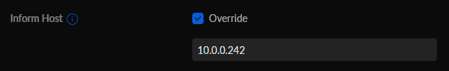
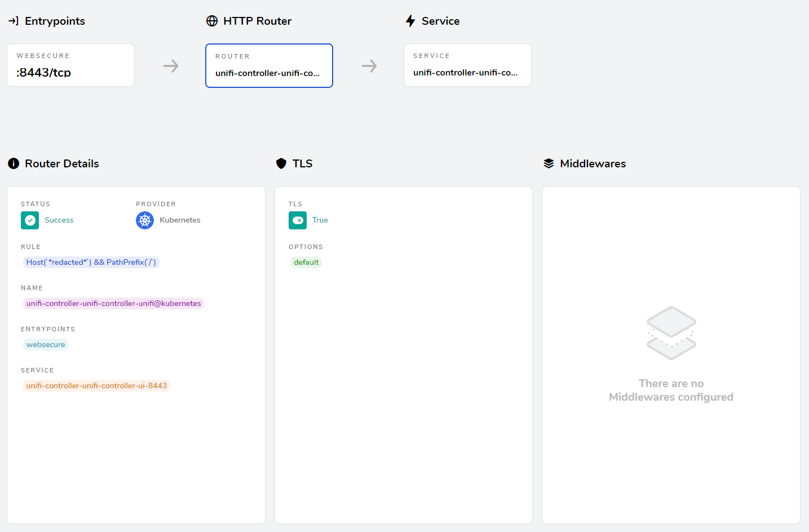
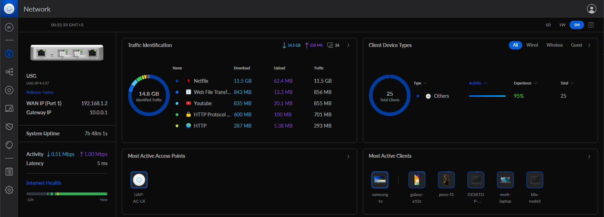

## Intro

Recently I started migrating all my selfhosted applications from standalone docker containers to kubernetes. The application that gave me the most trouble to migrate was Ubiquiti's Unifi Controller.
In this post I'll describe how to deploy the Unifi Controller on kubernetes and access it's console through a Traefik reverse proxy.

## Deploying UniFi Controller

### Namespace

```yaml
apiVersion: v1
kind: Namespace
metadata:
  name: unifi-controller
```

Just the namespace; nothing special here.

### Persistent Volume Claim

```yaml
apiVersion: v1
kind: PersistentVolumeClaim
metadata:
  name: unifi-longhorn-pvc
  namespace: unifi-controller
spec:
  storageClassName: longhorn
  accessModes:
    - ReadWriteMany
  resources:
    requests:
      storage: 5Gi
```

For storage I'm using a [Longhorn](https://longhorn.io/) volume, but of course you can use anything you prefer.


### Deployment

```yaml
apiVersion: apps/v1
kind: Deployment
metadata:
  labels:
    app: unifi-controller
  name: unifi-controller
  namespace: unifi-controller
spec:
  replicas: 1
  selector:
    matchLabels:
      app: unifi-controller
  template:
    metadata:
      labels:
        app: unifi-controller
    spec:
      containers:
        - image: lscr.io/linuxserver/unifi-controller:latest
          name: unifi-controller
          resources:
            requests:
              cpu: "100m"
              memory: "1024Mi"
            limits:
              cpu: "500m"
              memory: "2048Mi"
          ports:
          - name: device-comm
            containerPort: 8080
            protocol: TCP
          - name: stun
            containerPort: 3478
            protocol: UDP
          - name: default-console
            containerPort: 8443
            protocol: TCP
          - name: secure-redirect
            containerPort: 8843
            protocol: TCP
          - name: http-redirect
            containerPort: 8880
            protocol: TCP
          - name: speedtest
            containerPort: 6789
            protocol: TCP
          - name: unifi-disc
            containerPort: 10001
            protocol: UDP
          - name: unifi-disc-l2
            containerPort: 1900
            protocol: UDP
          volumeMounts:
            - name: unifi-controller-config
              mountPath: /config
          env:
            - name: TZ
              value: Europe/Athens
      volumes:
        - name: unifi-controller-config
          persistentVolumeClaim:
            claimName: unifi-longhorn-pvc
```

The deployment is pretty straightforward.

### Services

```yaml
apiVersion: v1
kind: Service
metadata:
  name: unifi-controller
  namespace: unifi-controller
spec:
  selector:
    app: unifi-controller
  ports:
    - name: stun
      port: 3478
      protocol: UDP
    - name: secure-redirect
      port: 8843
      protocol: TCP
    - name: http-redirect
      port: 8880
      protocol: TCP
    - name: speedtest
      port: 6789
      protocol: TCP
    - name: unifi-disc
      port: 10001
      protocol: UDP
    - name: unifi-disc-l2
      port: 1900
      protocol: UDP
---
apiVersion: v1
kind: Service
metadata:
  name: unifi-controller-ui
  namespace: unifi-controller
  annotations:
    traefik.ingress.kubernetes.io/service.serversscheme: https
    traefik.ingress.kubernetes.io/service.serverstransport: unifi-controller-unifi-controller-ui@kubernetescrd
spec:
  selector:
    app: unifi-controller
  ports:
    - name: default-console
      port: 8443
      protocol: TCP
---
apiVersion: v1
kind: Service
metadata:
  name: unifi-controller-dev-com
  namespace: unifi-controller
  annotations:
    metallb.universe.tf/loadBalancerIPs: 10.0.0.242
spec:
  type: LoadBalancer
  selector:
    app: unifi-controller
  ports:
    - name: device-comm
      port: 8080
      protocol: TCP
---
apiVersion: traefik.containo.us/v1alpha1
kind: ServersTransport
metadata:
  name: unifi-controller-ui
  namespace: unifi-controller
spec:
  insecureSkipVerify: true
```

Defining the services for the controller UI console and for device communication was what gave the most trouble. 

#### Controller UI

The UI console is accessed on port 8443 and requires a HTTPS connection. Furthermore, the console's SSL certificate is self signed.

To accomodate for this, I defined a separate service for the UI console, `unifi-controller-ui`, and added the ```traefik.ingress.kubernetes.io/service.serversscheme: https``` annotation so that Traefik will establish a HTTPS connection with the service.

I then created a ```ServersTransport``` object with the ```insecureSkipVerify: true``` option and added referenced it in the service's ```traefik.ingress.kubernetes.io/service.serverstransport``` annotation. This makes Traefik ignore the self signed certificate.

#### Device communication

The service for device communication was more straightforward. I created the `unifi-controller-dev-com` service, and since I'm using Metallb I created a service of type LoadBalancer and set it's IP with the annotation `metallb.universe.tf/loadBalancerIPs`

After the controller is up and running, I changed the Inform Host in the settings to the same IP, so that the devices will be able to communicate with the controller:



With this, the network devices will be able to be adopted properly by the controller.

### Ingress

```yaml
apiVersion: networking.k8s.io/v1
kind: Ingress
metadata:
  name: unifi-controller
  namespace: unifi-controller
  annotations:
    traefik.ingress.kubernetes.io/router.entrypoints: websecure
    cert-manager.io/cluster-issuer: "lets-encrypt-dns"
spec:
  tls:
    - hosts:
        - *redacted*
      secretName: tls-unifi-ingress-dns
  rules:
    - host: *redacted*
      http:
        paths:
          - path: /
            pathType: Prefix
            backend:
              service:
                name: unifi-controller-ui
                port:
                  number: 8443
```

Finally I created an Ingress object to access the Controller's UI. Since I'm using [cert-manager](https://cert-manager.io/) to automatically issue `Let's Encrypt` certificates, I added the relevant annotations to the object.



## Conclusion

And that's it! It took some troubleshooting but I finally managed to run Unifi Controller on kubernetes! 🎉

